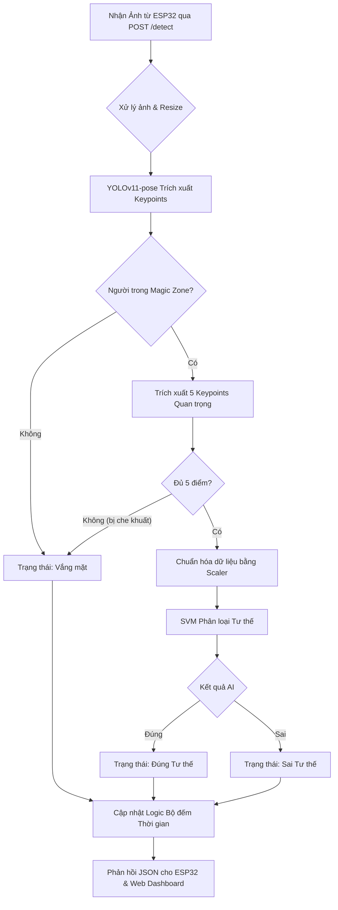

# 🧠 AI Server - Hệ thống Trí tuệ Nhân tạo & Xử lý Trung tâm

Thư mục này chứa toàn bộ mã nguồn của Máy chủ Trí tuệ Nhân tạo (AI Server) đóng vai trò là "bộ não" của Hệ thống Giám sát Tư thế Ngồi. Server được xây dựng trên nền tảng **Flask (Python)** kết hợp cùng **Ultralytics YOLO** và **Scikit-learn** để phân tích hình ảnh theo thời gian thực.

## 🌟 Chức năng cốt lõi

1. **Phân tích hình dáng cơ thể (Pose Estimation):** 
   Sử dụng mô hình `yolo11n-pose.pt` để trích xuất 5 điểm mốc quan trọng (Keypoints) trên cơ thể người dùng bao gồm: Mũi, Vai trái, Vai phải, Hông trái, Hông phải.
2. **Đánh giá tư thế (Posture Classification):** 
   Dữ liệu các điểm mốc sau khi được chuẩn hóa (`posture_scaler.joblib`) sẽ được đưa qua mô hình Support Vector Machine (`posture_classifier.joblib`) để phân loại tư thế hiện tại là **Đúng** hay **Sai**.
3. **Vùng Ma Thuật (Magic Zone):** 
   AI chỉ tập trung nhận diện và đánh giá người dùng nằm trong một khu vực được chỉ định (Vùng Vàng) nhằm loại bỏ hoàn toàn nhiễu từ những người đi ngang qua khung hình.
4. **Hệ thống Cảnh báo Đa cấp độ:**
   - Cảnh báo tư thế sai.
   - Cảnh báo ngồi sai tư thế quá lâu (Long Incorrect).
   - Cảnh báo ngồi liên tục quá lâu (Long Sitting).
5. **Giao tiếp Đa phương thức (REST API):**
   Cung cấp các API HTTP POST/GET để nhận hình ảnh, dữ liệu nhịp tim/SpO2 từ phần cứng ESP32 và phục vụ dữ liệu cho Web Dashboard.

## 📊 Sơ đồ luồng xử lý (Workflow)

Dưới đây là sơ đồ luồng xử lý luân chuyển dữ liệu từ khi nhận ảnh cho đến khi đưa ra quyết định cảnh báo:



## 🔌 Danh sách API (Endpoints) chính

| Endpoint | Method | Chức năng |
|----------|--------|-----------|
| `/detect` | POST | Nhận ảnh dạng JPEG từ ESP32-Cam, xử lý AI và trả về trạng thái cảnh báo |
| `/sensor_data` | POST | Nhận dữ liệu nhịp tim (BPM) và SpO2 từ cảm biến MAX30102 |
| `/api/get_status` | GET | Cung cấp dữ liệu thời gian thực (tư thế, cảnh báo, thời gian ngồi) cho Dashboard |
| `/api/history` | GET | Trả về chuỗi lịch sử dữ liệu sức khỏe để vẽ biểu đồ |
| `/api/set_config` | POST | Thay đổi ngưỡng thời gian cảnh báo từ xa |
| `/api/set_zone_config` | POST | Điều chỉnh tọa độ của "Magic Zone" |

## 🚀 Hướng dẫn Chạy Server

### Yêu cầu hệ thống
- Python 3.9 trở lên.
- Nên cài đặt trên môi trường ảo (Virtual Environment) để tránh xung đột thư viện.

### Cài đặt
1. Cài đặt các thư viện phụ thuộc:
```bash
pip install Flask opencv-python ultralytics scikit-learn joblib numpy waitress torch
```

2. Khởi chạy Server:
```bash
python server.py
```
> [!NOTE]  
> Khi chạy thành công, Server sẽ lắng nghe ở cổng `8000` (http://0.0.0.0:8000). Các giao diện Web Dashboard có thể được truy cập trực tiếp qua địa chỉ này.

## 📂 Cấu trúc file AI_Server

- `server.py`: Mã nguồn chính của Server (Flask + Waitress).
- `yolo11n-pose.pt`: Trọng số mô hình YOLO (nhẹ và nhanh nhất).
- `posture_classifier.joblib`: Mô hình phân loại tư thế SVM.
- `posture_scaler.joblib`: Bộ tiền xử lý (chuẩn hóa dữ liệu) trước khi đưa vào SVM.
- `training/`: Thư mục chứa các script Jupyter Notebook hỗ trợ chụp ảnh làm dataset và huấn luyện lại mô hình SVM nếu cần.
