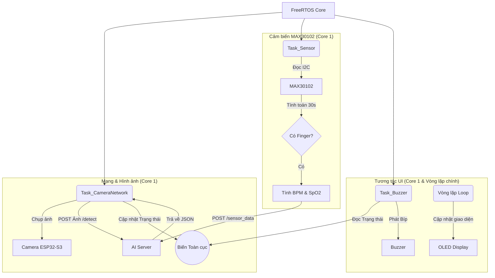

# 🔌 ESP32_Firmware - Trạm Thu thập & Tương tác Dữ liệu Đầu cuối

Thư mục này chứa mã nguồn nhúng (C/C++) dành cho vi điều khiển **ESP32-S3**. Phần sụn (Firmware) này đóng vai trò là "tai mắt" của hệ thống, thực hiện thu thập hình ảnh, dữ liệu nhịp tim, SpO2 và tương tác trực tiếp với người dùng thông qua màn hình OLED cùng còi báo động.

## 🌟 Chức năng cốt lõi

1. **Thu thập hình ảnh (Camera Vision):**
   Sử dụng module Camera tích hợp trên board mạch ESP32-S3 để liên tục chụp ảnh người dùng và truyền (POST) về AI Server qua giao thức HTTPS.
2. **Đo Nhịp tim & SpO2 (Medical Sensor):**
   Giao tiếp với cảm biến **MAX30102** qua chuẩn I2C. Firmware tích hợp thuật toán sinh trắc học để đo và tính toán chính xác nhịp tim (BPM) cùng nồng độ oxy trong máu (SpO2) mỗi khi phát hiện có ngón tay đặt lên.
3. **Hiển thị trực quan (OLED Display):**
   Sử dụng màn hình **OLED SH1106 128x64** để hiển thị:
   - Trạng thái tư thế hiện tại (CORRECT, INCORRECT, LONG WRONG!, LONG SIT!!, ABSENT).
   - Tiến trình đo nhịp tim (đồng hồ đếm ngược 30 giây).
   - Kết quả đo nhịp tim và SpO2 theo thời gian thực.
4. **Hệ thống cảnh báo (Buzzer Alert):**
   Phát ra các tiếng bíp (beep) theo nhiều nhịp điệu khác nhau tùy thuộc vào mức độ nghiêm trọng (Nhắc nhở ngồi sai, Cảnh báo ngồi sai quá lâu, Cảnh báo ngồi liên tục quá lâu).
5. **Đa nhiệm mượt mà (FreeRTOS):**
   Chia tách phần mềm thành nhiều Task hoạt động song song để đảm bảo Camera truyền ảnh không bị gián đoạn khi cảm biến đang đo nhịp tim.

## 📊 Sơ đồ Kiến trúc Đa nhiệm (FreeRTOS Tasks)

Hệ thống sử dụng FreeRTOS để quản lý 3 luồng tác vụ (Tasks) chính hoạt động độc lập và giao tiếp với nhau qua biến toàn cục/Mutex:



## 🛠 Sơ đồ Kết nối Phần cứng (Pinout)

| Linh kiện | Chân trên ESP32-S3 | Chức năng |
|-----------|--------------------|-----------|
| **OLED SH1106 & MAX30102** | `SDA: 41`, `SCL: 42` | Giao tiếp I2C chung |
| **Buzzer (Còi chíp)** | `Pin 14` | Cảnh báo âm thanh (PWM) |
| **Camera Module** | (Tích hợp sẵn) | Lấy hình ảnh |

## 🚀 Hướng dẫn Nạp Code (Flashing)

### 1. Chuẩn bị Môi trường
- Cài đặt **Arduino IDE** (phiên bản 2.x khuyến nghị).
- Thêm đường dẫn `https://raw.githubusercontent.com/espressif/arduino-esp32/gh-pages/package_esp32_index.json` vào *Preferences -> Additional Boards Manager URLs*.
- Tải gói Board **esp32 by Espressif Systems**.

### 2. Cài đặt Thư viện
Vào *Library Manager* trong Arduino IDE, tìm và cài đặt:
- `U8g2` (Hiển thị OLED).
- `SparkFun MAX3010x Pulse and Proximity Sensor` (Cảm biến nhịp tim).
- `ArduinoJson` (Xử lý chuỗi JSON từ Server).

### 3. Cấu hình & Nạp Code
1. Mở file `firmware.ino`.
2. Thay đổi cấu hình WiFi ở dòng 79-80:
   ```cpp
   const char* ssid = "TÊN_WIFI_CỦA_BẠN"; 
   const char* password = "MẬT_KHẨU_WIFI"; 
   ```
3. Cập nhật `serverURL` và `sensorURL` trỏ về IP của AI Server (nếu chạy local thì điền `http://[IP_MÁY_TÍNH]:8000/...`).
4. Chọn Board: **ESP32S3 Dev Module**.
5. Cấu hình Board:
   - Tùy chọn *PSRAM: "OPI PSRAM"* (Rất quan trọng để chạy Camera).
6. Nhấn nút **Upload**.

---
*Lưu ý: Firmware có sẵn tính năng Auto-Reconnect WiFi, nếu mất mạng thiết bị sẽ tự động dò tìm và kết nối lại sau 20 giây.*
